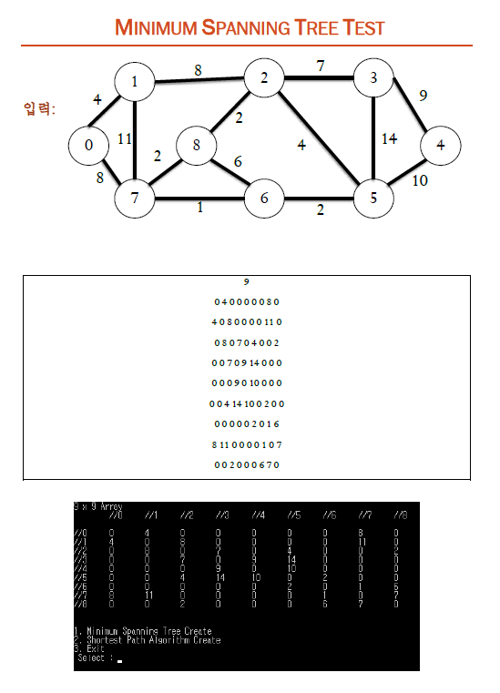
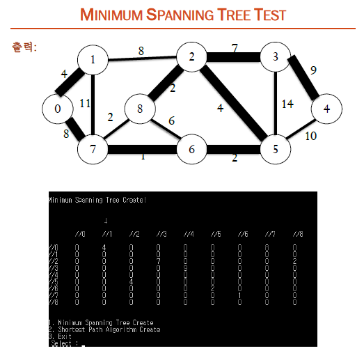
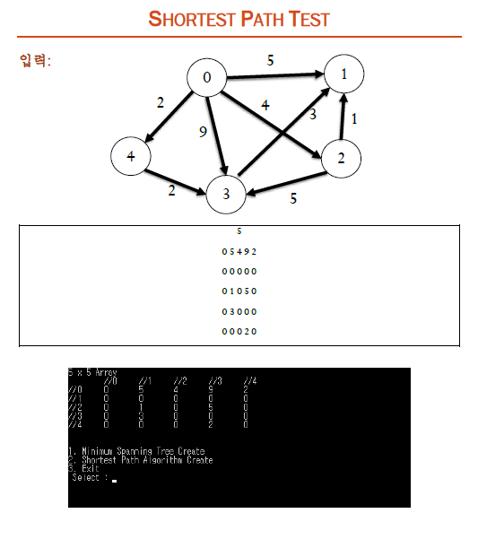
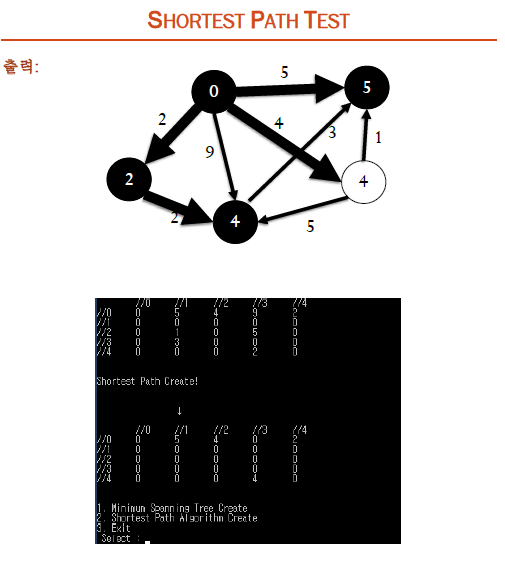

MinimumSpanningTree_ShortestPath
===
### Date: 2016-12~
#### university programming assignments.
-------------
## MinimumSpanningTree
Spanning Tree 중에서 사용된 간선들의 가중치 합이 최소인 트리

## ShortestPath
하나의 출발점에서 각 정점까지 도달하는데 비용을 계산하여 최단경로를 구하는 것

